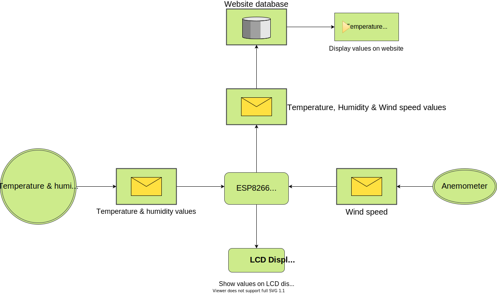

# Weather Station with ESP8266

## Libraries
Required library from RicArch97: https://github.com/RicArch97/ESP-smart-things.

## Important note
To use the ssid and password you will need to create your own `credentials.h` headerfile using
the `credentials_example.h`. You can simply just copy it.  
To upload the data to your own website edit the information in the `httpclient.h` file.

## Design
Here are the designs on how the circuit and system is built.

### Fritzing

### Electrical Scheme

### Software Architecture
<!--  -->